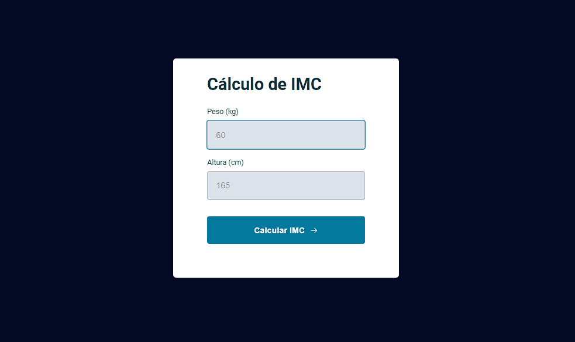

<h1 align="center"> Cálculo IMC </h1>

Inserir os valores de peso(kg) e altura(cm) para calcular o IMC 

  

## 🚀 Tecnologias

Esse projeto foi desenvolvido com as seguintes tecnologias:

- HTML e CSS
- JavaScript
- Git e Github
- Figma

## 💻 Projeto

O Cálculo IMC tem como intuito exercitar o uso de lógica de programação, variáveis, eventos e callbacks. Além do uso de modularização no código de Js.

- [Acesse o projeto finalizado, online](https://matheusalm0.github.io/CalculateIMC/)
---
